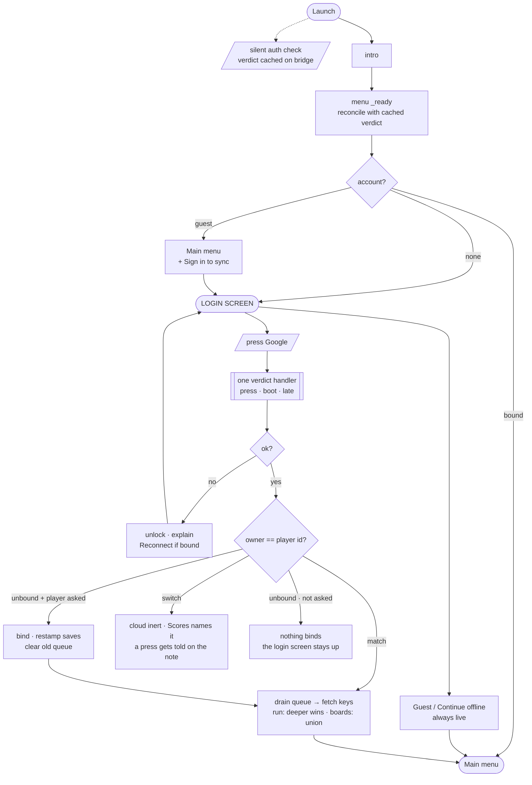
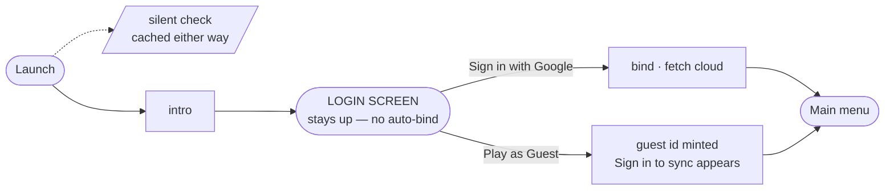
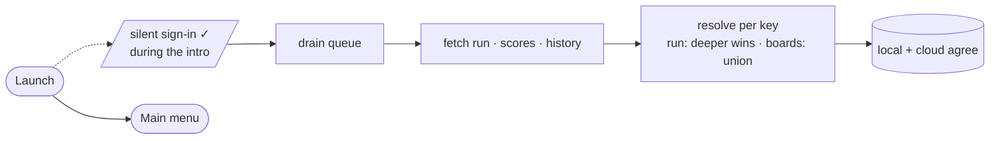
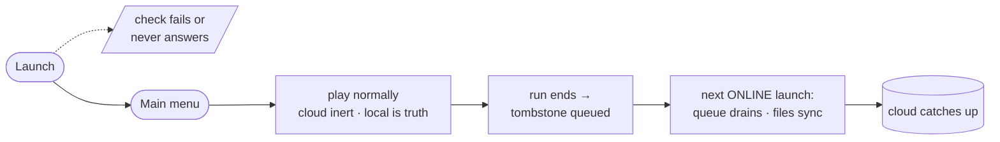
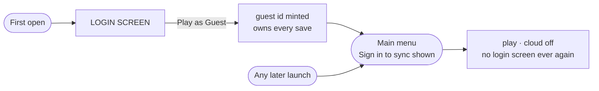
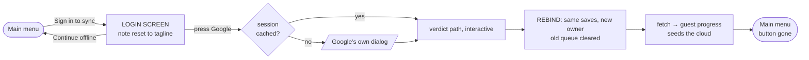
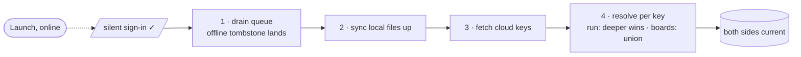
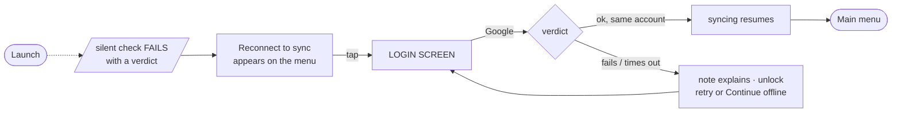
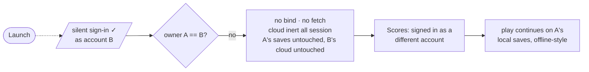

# Auth flows — Play Games sign-in (issue 86)

Every player journey through sign-in, account binding and cloud sync, as small
flowcharts. Traced from the shipped code, not from intent; kept in step with
`scripts/menu.gd`, `scripts/account.gd`, `scripts/cloud/play_games_bridge.gd`,
`scripts/cloud/cloud_backend_play_games.gd` and `scripts/cloud_save.gd`.

Design rationale: `docs/adr/0003-synchronous-cloud-contract-over-async-sdk.md`.
Open design questions (account switch, per-account saves): issue 86.

Conventions: `[/slanted/]` nodes are asynchronous — control leaves us and may
answer late or never. The guest/offline button is the login screen's one
guaranteed exit: always visible, never disabled.

## 0 · Full flow

## 1 · First app opening

The silent check resolves during the intro, but it never answers the login
screen's question by itself — only a press binds, and an explicit "Play as
Guest" is never overridden.

## 2 · Returning player

No screens, no questions — the cloud merges behind the menu.

## 3 · Offline player

Sign-in is never on the critical path to playing.

## 4–5 · Guest, and returning guest

A guest is a real account that owns saves; the cloud simply stays off.

## 6 · Returning guest signs in to sync

The rebind: progress follows the player because it was never a second history.
The press is the consent.

## 7 · Back online after an offline session

Order is load-bearing: the queue drains before anything is pulled, or the pull
resolves against a cloud missing exactly those sessions.

## 8 · Player needs to sign in again

A lapsed session — revoked access, or the Play Games account removed from the
device — gets a visible, manual way back.

## 9 · Player switches Google account

The one journey that ends in a refusal — by design, until per-account saves
exist. Refusing is the only move that destroys nothing.

## Edge-case coverage

Found across the issue-86 review rounds; each handled in code, the
load-bearing ones pinned by desktop tests.

| Edge case | What happens |
| --- | --- |
| Double-press a provider | Buttons lock while an attempt is in flight; Guest never locks |
| Refused, then retry inside 30s | Generation counter: press #1's timer cannot fire on press #2 |
| Nothing ever answers | 30s timeout unlocks and explains; the guest exit was live throughout |
| Verdict arrives after the timeout | For a bound account, sync resumes. For an unbound press the consent expired with the timeout — but the retry the message invites succeeds instantly, since the session is now cached |
| Leave mid-sign-in, start a run | Timer and verdict fire into a freed menu safely; the next menu reconciles from the bridge's cached state |
| Verdict lands while player is in Settings/Guide/Scores | Login screen dismisses only if it is what is on screen |
| Boot verdict with no listener (intro) | Cached on the bridge; every new menu reconciles on arrival |
| Silent success while the login screen is up | Screen stays; only a press may bind; "Play as Guest" is never overridden |
| Plugin reports an empty player id | Never binds — an empty owner would be permanent. Theoretical: the bridge sets the id before any ok verdict |
| account.json missing / corrupt / empty owner | Login screen returns; guest press rewrites it — recoverable in one launch *(pinned by test)* |
| account.json unwritable (disk full) | Session runs on the cache; error logged; login returns next launch — escapable every time |
| Queue crossing accounts | Rebind clears the previous owner's queue *(pinned by test)* |
| Ownership gate on every cloud path | `is_available()` = signed in AND owner matches *(pinned by test, all three states)* |
| Two devices' boards | Scores/history sync by per-entry UNION, never pick-a-side; history unions as a BAG so identical real runs both survive *(pinned by test)* |
| Cloud snapshot corrupt or empty | Decodes to null → local kept; empty is the normal first-sync case |
| Two snapshots conflict | Resolved silently — deeper run, then last write — winner re-saved; Google's picker never shows |
| Finished run resurrecting from the cloud | Game over pushes a null tombstone; sync declines to restore it *(pinned by test)* |
| Save from a newer build arrives via cloud | Continue is hidden rather than loading fields this build cannot read |
| Fresh guest, same session | "Sign in to sync" appears immediately on guest creation |
| Stale login note on re-entry | Reset to the tagline every time the screen opens from the menu |
| Apple button (issue 87 pending) | Honest "isn't available on this device yet" — never locks, never pretends |
| Desktop / no Play Services | Providers refuse with the same message; Guest carries the whole flow |

## Known and accepted (documented, not fixed)

- A snapshot CONFLICT still settles pick-a-side (the plugin's conflict path
  has no merger); self-healing — the next sync re-unions, costing at most one
  boot's worth of the other side's board entries.
- A foreign verdict can be adopted by an in-flight press — the SDK's
  `sign_in_finished` carries no attempt id; fixing it re-adds the per-attempt
  bookkeeping the one-handler design deleted.
- The account-switch answer is a safe refusal pending the per-account-saves
  design call (issue 86).
- A silent check that never answers leaves the cloud dark for one session and
  self-heals next launch.
- Everything through Google is verified by reading and desktop pins, not yet
  on a device.
